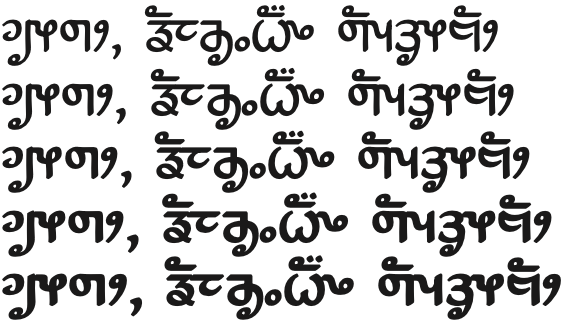

# Namdhinggo

[![][Fontbakery]](https://devosb.github.io/gf-namdhinggo/fontbakery/fontbakery-report.html)
[![][Universal]](https://devosb.github.io/gf-namdhinggo/fontbakery/fontbakery-report.html)
[![][GF Profile]](https://devosb.github.io/gf-namdhinggo/fontbakery/fontbakery-report.html)
[![][Outline Correctness]](https://devosb.github.io/gf-namdhinggo/fontbakery/fontbakery-report.html)
[![][Shaping]](https://devosb.github.io/gf-namdhinggo/fontbakery/fontbakery-report.html)

[Fontbakery]: https://img.shields.io/endpoint?url=https%3A%2F%2Fraw.githubusercontent.com%2Fdevosb%2Fgf-namdhinggo%2Fgh-pages%2Fbadges%2Foverall.json
[GF Profile]: https://img.shields.io/endpoint?url=https%3A%2F%2Fraw.githubusercontent.com%2Fdevosb%2Fgf-namdhinggo%2Fgh-pages%2Fbadges%2FGoogleFonts.json
[Outline Correctness]: https://img.shields.io/endpoint?url=https%3A%2F%2Fraw.githubusercontent.com%2Fdevosb%2Fgf-namdhinggo%2Fgh-pages%2Fbadges%2FOutlineCorrectnessChecks.json
[Shaping]: https://img.shields.io/endpoint?url=https%3A%2F%2Fraw.githubusercontent.com%2Fdevosb%2Fgf-namdhinggo%2Fgh-pages%2Fbadges%2FShapingChecks.json
[Universal]: https://img.shields.io/endpoint?url=https%3A%2F%2Fraw.githubusercontent.com%2Fdevosb%2Fgf-namdhinggo%2Fgh-pages%2Fbadges%2FUniversal.json

The Limbu, or Kirat Sirijonga, script is used by around 400,000 people in Nepal.

This font was designed to support literacy and materials development work in the Limbu language.

## About

[SIL International](https://www.sil.org/) is a global, faith-based nonprofit that works with local communities around the world to develop language solutions that expand possibilities for a better life.

We are involved in approximately 1,350 active language projects in 104 countries. These projects impact more than 1.1 billion people within 1,600 local communities. SIL’s work brings together more than 4,300 staff from 89 countries who work alongside thousands more local partners and community volunteers worldwide. Our services are available without regard to religious belief, political ideology, gender, race or ethnic background.

Our Vision: We long to see people flourishing in community using the languages they value most.

Our Mission: Inspired by God’s love, we advocate, build capacity, and work with local communities to apply language expertise that advances meaningful development, education, and engagement with Scripture.

[SIL Language Technology](https://software.sil.org/) supports these activities by developing [software](https://software.sil.org/products/), [fonts](https://software.sil.org/fonts/), and [keyboard technologies](https://keyman.com/).

## Building

Fonts are built automatically by GitHub Actions - take a look in the "Actions" tab for the latest build.

If you want to build fonts manually on your own computer:

* `make build` will produce font files.
* `make test` will run [FontBakery](https://github.com/googlefonts/fontbakery)'s quality assurance tests.
* `make proof` will generate HTML proof files.

The proof files and QA tests are also available automatically via GitHub Actions - look at https://devosb.github.io/gf-namdhinggo.

## Changelog

When you update your font (new version or new release), please report all notable changes here, with a date.
[Font Versioning](https://github.com/googlefonts/gf-docs/tree/main/Spec#font-versioning) is based on semver.
Changelog example:

**26 May 2021. Version 2.13**
- MAJOR Font turned to a variable font.
- SIGNIFICANT New Stylistic sets added.

## License

This Font Software is licensed under the SIL Open Font License, Version 1.1.
This license is available with a FAQ at
https://openfontlicense.org

## Repository Layout

This font repository structure is inspired by [Unified Font Repository v0.3](https://github.com/unified-font-repository/Unified-Font-Repository), modified for the Google Fonts workflow.
